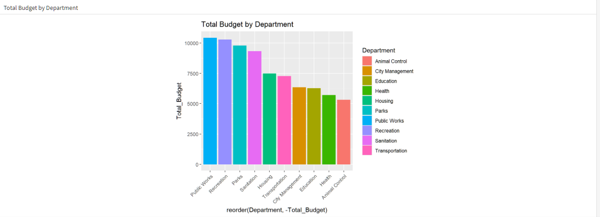
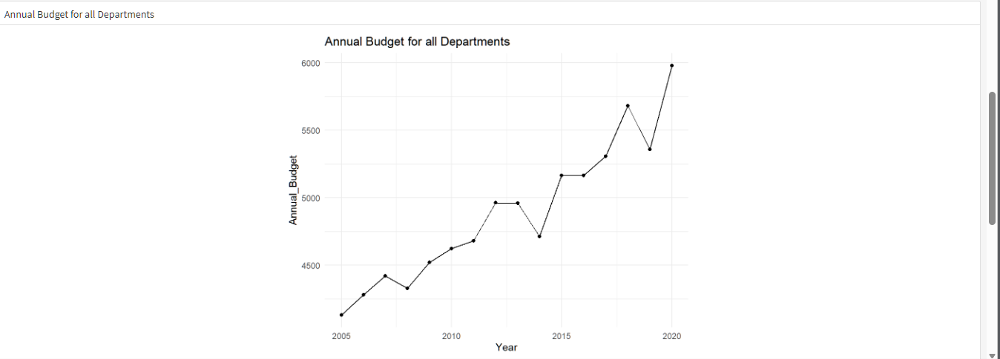
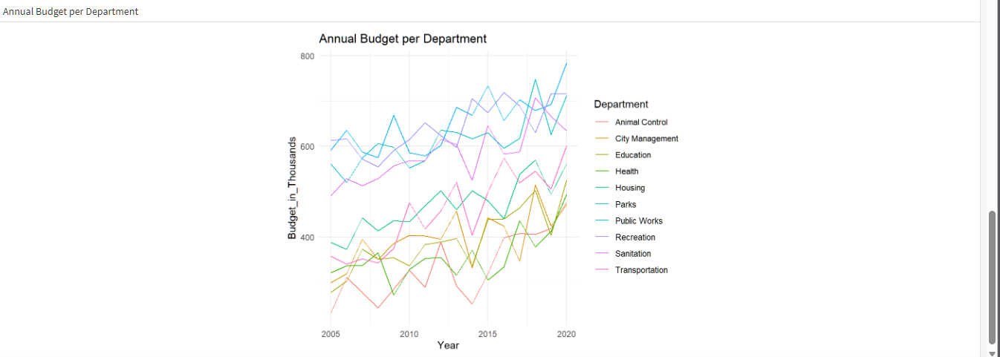

# parks-and-rec-budget-analysis-r
R data visualization project analyzing Parks &amp; Recreation departmental budgets over time.

# Parks & Recreation Budget Analysis in R

## Project Overview

This project is a data visualization analysis of Parks & Recreation departmental budgets using **R**.

The project was completed as part of my R learning journey, with a focus on using R to transform data, aggregate information, and communicate budget trends through visualizations.

The analysis uses the `dplyr` and `ggplot2` packages to examine departmental budgets across multiple years.

## Objectives

The project was designed to:

* Compare the total budget allocated to each department.
* Examine the annual budget across all departments.
* Explore how the budget for individual departments changed over time.
* Practice data transformation and visualization techniques in R.

## Dataset

The dataset used for this project is **`parks_and_rec_budget`**.

It contains budget information by:

* **Year**
* **Department**
* **Budget in Thousands**

The data covers the period from **2005 to 2020** and includes multiple city departments.

## Tools & Technologies

* **R**
* **RStudio**
* **dplyr**
* **ggplot2**
* **R Markdown**
* **Flexdashboard**
* **RPubs**

## Analysis Process

### 1. Data Import

The dataset was imported into R using `read.csv()`.

The `dplyr` and `ggplot2` libraries were then loaded for data transformation and visualization.

### 2. Total Budget by Department

The first visualization groups the data by department and calculates the total budget allocated to each department. This visualization makes it possible to compare the overall budget levels across departments.

### 3. Annual Budget for All Departments

The second visualization groups the data by year and calculates the total annual budget across all departments.

A line chart was created to show how the combined annual budget changed over time.

### 4. Annual Budget per Department

The third visualization shows how the budget for each department changed over time.

A line chart was created with department represented by color, allowing the budget trends of individual departments to be compared over time.

## R Techniques Demonstrated

This project allowed me to apply several R techniques, including:

* Importing data with `read.csv()`
* Loading and using R packages
* Grouping data with `group_by()`
* Aggregating data with `summarise()`
* Calculating total budgets with `sum()`
* Reordering categories for visualization
* Creating bar charts with `ggplot2`
* Creating line charts with `ggplot2`
* Adding titles and themes to visualizations
* Creating an R Markdown document
* Building a Flexdashboard
* Publishing the completed visualization to RPubs

## Project Workflow

The project followed this workflow:

**Import Data → Transform Data → Aggregate Data → Visualize → Build Flexdashboard → Publish to RPubs**

The R code was transferred into an R Markdown document, which was then knitted into a Flexdashboard before being published on RPubs.

## Published Visualization

The completed interactive visualization is available on RPubs:

**[View the Parks & Recreation Budget Analysis](https://rpubs.com/Michael_85/1454725)**

## What I Learned

This project gave me practical experience using R for data analysis and visualization.

More importantly, it allowed me to move beyond individual R exercises and apply data transformation and visualization techniques to a complete analysis workflow — from importing a dataset through to publishing the final results.

## Future Improvements

Potential future improvements to this project include:

* Adding additional exploratory analysis.
* Creating more advanced visualizations.
* Adding interactive elements to the dashboard.
* Exploring year-over-year budget changes.
* Examining which departments experienced the largest increases or decreases over time.

---

**Author:** Michael
**Tools:** R | RStudio | dplyr | ggplot2 | R Markdown | Flexdashboard | RPubs
